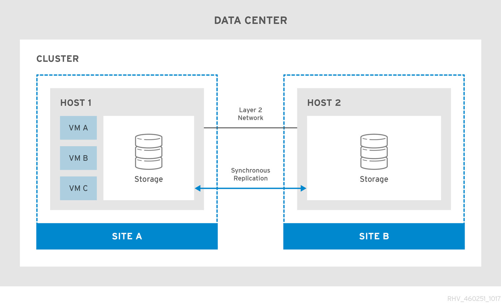
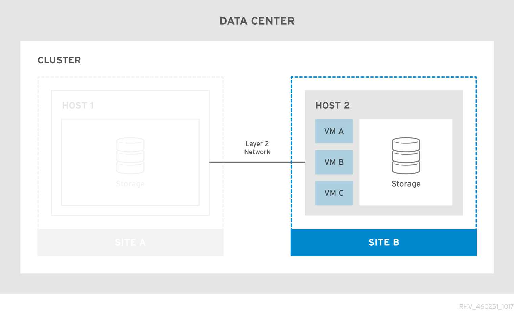

# Active-Active Overview

Red Hat Virtualization supports an active-active disaster recovery failover configuration that can span two sites. Both sites are active, and if the primary site becomes unavailable, the Red Hat Virtualization environment will continue to operate in the secondary site to ensure business continuity. 

The active-active failover is achieved by configuring a stretch cluster where hosts capable of running the virtual machines are located in the primary and secondary site. All the hosts belong to the same Red Hat Virtualization cluster.

You require replicated storage that is writeable on both sites to allow virtual machines to migrate between sites and continue running on the site’s storage.

**Stretch Cluster Configuration**

Virtual machines will migrate to the secondary site if the primary site becomes unavailable. The virtual machines will automatically failback to the primary site when the site becomes available and the storage is replicated in both sites.

**Failed Over Stretch Cluster**

**Important:** To ensure virtual machine failover and failback works:

* Virtual machines must be configured to be highly available, and each virtual machine must have a lease on a target storage domain to ensure the virtual machine can start even without power management. 
* Soft enforced virtual machine to host affinity must be configured to ensure the virtual machines only start on the selected hosts.

For more information see [Improving Uptime with Virtual Machine High Availability](https://access.redhat.com/documentation/en-us/red_hat_virtualization/4.1/html-single/virtual_machine_management_guide/#sect-Improving_Uptime_with_Virtual_Machine_High_Availability) and [Affinity Groups](https://access.redhat.com/documentation/en-us/red_hat_virtualization/4.1/html-single/virtual_machine_management_guide/#sect-Affinity_Groups) in the *Virtual Machine Management Guide*.

The stretched cluster configuration can be implemented using a self-hosted engine environment, or a standalone Manager environment. For more information about the different types of deployments see [Architecture](https://access.redhat.com/documentation/en-us/red_hat_virtualization/4.1/html/product_guide/introduction#architecture) in the *Product Guide*.
 
* [Network Considerations](../network_considerations)
* [Storage Considerations](../storage_considerations_active_active)
