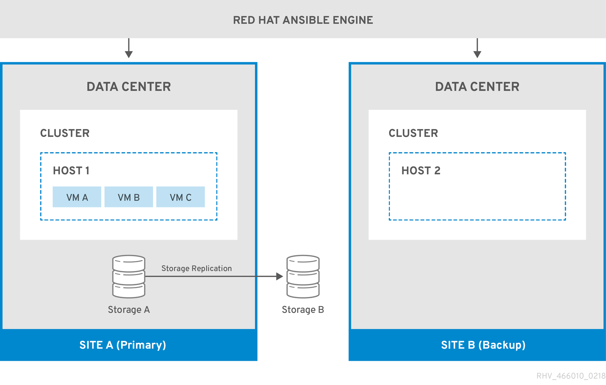
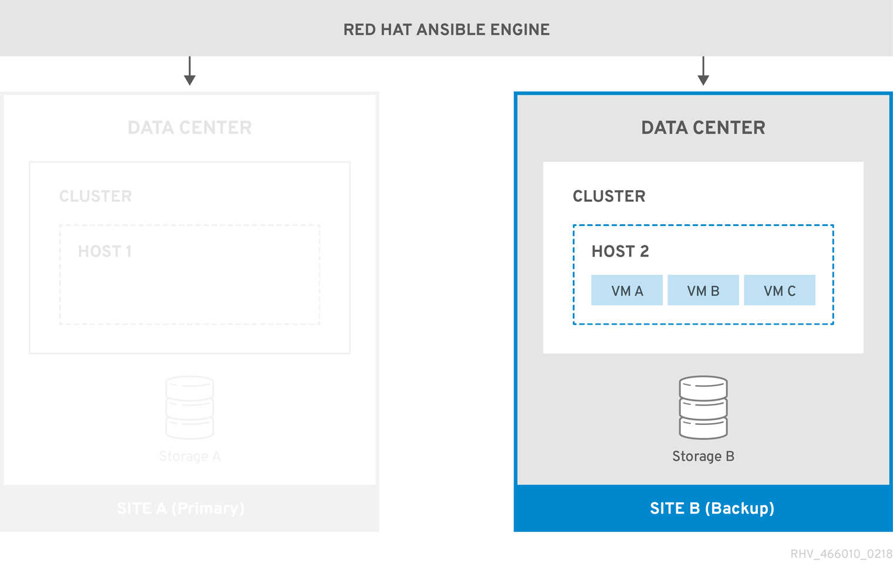

# Active-Passive Overview

Red Hat Virtualization supports an active-passive disaster recovery solution that can span two sites. If the primary site becomes unavailable, the Red Hat Virtualization environment can be forced to fail over to the secondary (backup) site.

The failover is achieved by configuring a Red Hat Virtualization environment in the secondary site, which requires:

* An active Red Hat Virtualization Manager.
* A data center and clusters.
* Networks with the same general connectivity as the primary site.
* Active hosts capable of running critical virtual machines after failover.

**Important:** You must ensure that the secondary environment has enough resources to run the failed over virtual machines, and that both the primary and secondary environments have identical Manager versions, data center and cluster compatibility levels, and PostgreSQL versions. The minimum supported compatibility level is 4.2.

Storage domains that contain virtual machine disks and templates in the primary site must be replicated. These replicated storage domains must not be attached to the secondary site.

The failover and failback process must be executed manually. To do this you need to create Ansible playbooks to map entities between the sites, and to manage the failover and failback processes. The mapping file instructs the Red Hat Virtualization components where to fail over or fail back to on the target site.

The following diagram describes an active-passive setup where the machine running Red Hat Ansible Engine is highly available, and has access to the `oVirt.disaster-recovery` Ansible role, configured playbooks, and mapping file. The storage domains that store the virtual machine disks in Site A is replicated. Site B has no virtual machines or attached storage domains.

**Active-Passive Configuration**

When the environment fails over to Site B, the storage domains are first attached and activated in Site B's data center, and then the virtual machines are registered. Highly available virtual machines will fail over first.

**Failover to Backup Site**

You will need to manually fail back to the primary site (Site A) when it is running again.

* [Network Considerations](../network_considerations_active_passive)
* [Storage Considerations](../storage_considerations_active-passive)
